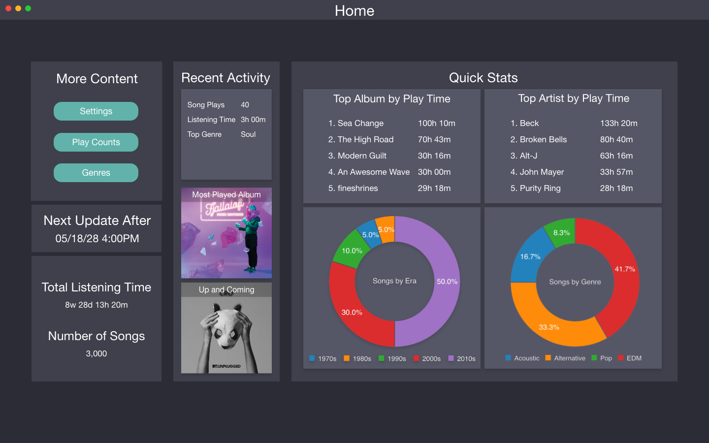
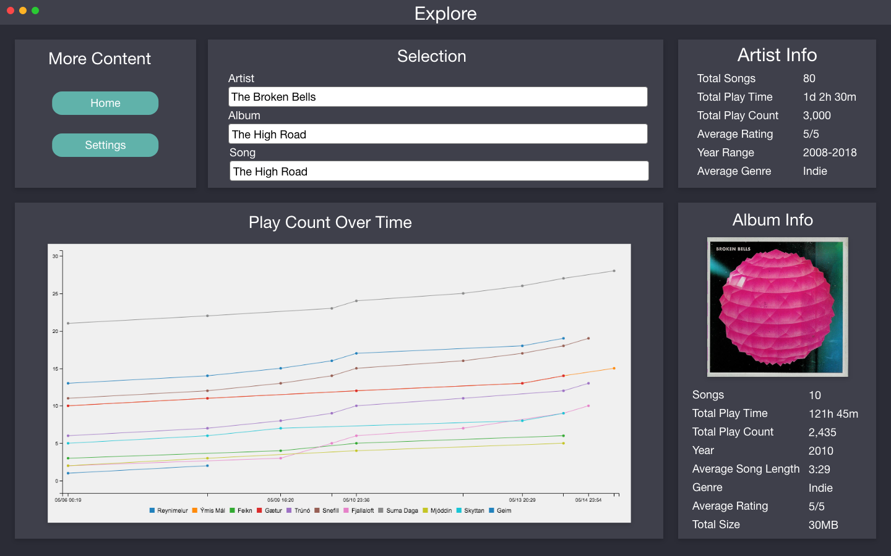
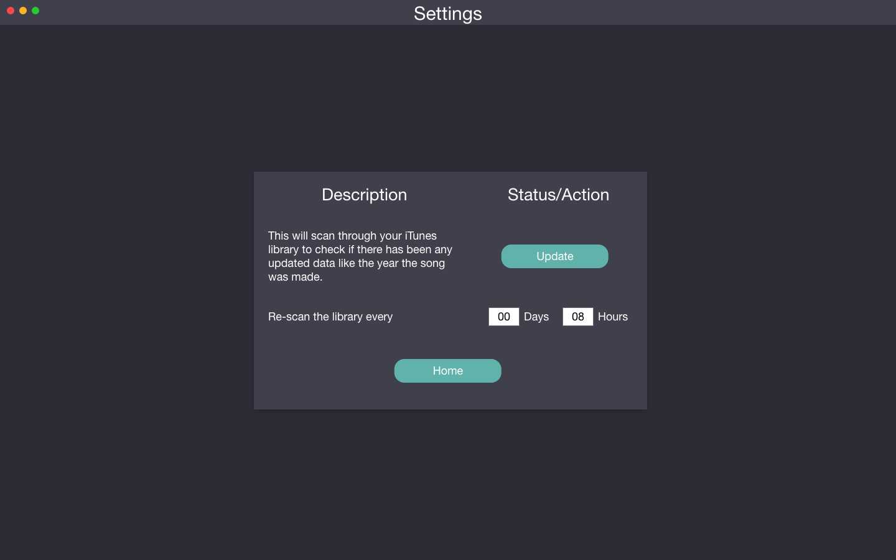
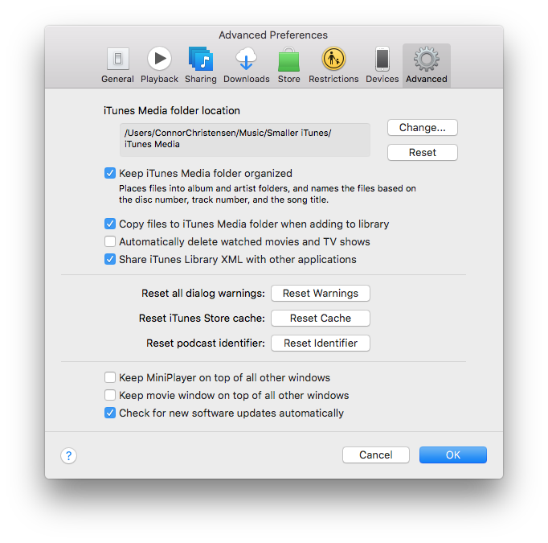

# TuneBase
An app for tracking data from iTunes over time

## Design

The application is designed to be visually pleasing, present the data in a clear way, and be easy for users to navigate

## Getting started
When the app first opens up, a file browser will pop up.
Use that browser to select the file **iTunes Library.xml**.
For locating the iTunes Library file, please consult the iTunes Library section.
After you select the file, it will remember where it is stored and will not ask for it again.

Please be patient while it extracts all the information from the iTunes library.
The time it takes to load depends on the size of your iTunes Library.
For me, around 5,000 thousand songs I have takes the app about 8 seconds to load.
After it extracts the information from the iTunes Library, it will store it in
an internal database.

## Data Storage
* The app will not damage any information on your iTunes Library, as it only reads from the file.
* There is no guarantee that the data will be maintained through the different versions of this software.
* All the information stored in the app will be kept private. The app does not even make a connection to the internet.

## iTunes Library
Apple makes a nice and reliable operating system, but because they don't need to
work with anyone else, all the stuff going on behind the scenes are confusing.

iTunes keeps a proprietary **itl** file called **iTunes Library.itl**.
This file is not human readable, and it is very difficult to interact with it.
This is what iTunes uses to read and write organization data so it knows what to
do when it starts up.
Some developers want to access that information, so Apple created a little
checkbox for the users to generate a separate XML file.

If you can't find the iTunes Library.xml file, go into iTunes settings and
check the box in the advanced pane that says "Share iTunes Library XML with
other applications"

